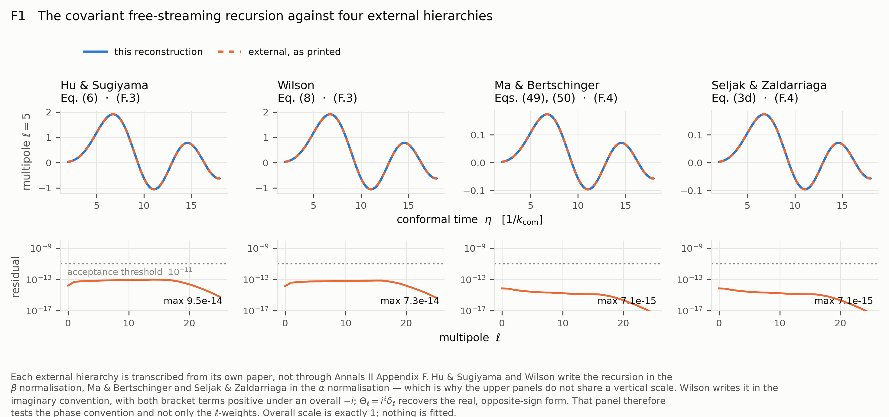

# 1+3 covariant CMB anisotropies reproducibility bundle

Version: v1.0.0 — First public analytical reproducibility release. Supplementary
code and materials for: Tim Gebbie, *"Frame covariance of CMB lensing in the exact $1+3$ covariant radiation hierarchy,"*
arXiv: identifier assigned on submission.

## Key figure: recursion and external hierarchies



The covariant free-streaming recursion of *Annals II* Appendix F against Hu &
Sugiyama Eq. (6), Wilson Eq. (8), Ma & Bertschinger Eqs. (49)/(50) and Seljak &
Zaldarriaga Eq. (3d), each read from its own paper. Residuals of 10⁻¹³–10⁻¹⁴
against a 10⁻¹¹ threshold, at overall scale exactly 1. Two distinct
normalisations and two distinct phase conventions — Wilson writes the recursion
in the imaginary convention, so his panel tests the phase and not only the
ℓ-weights.

> **The designated key figure for v1.0.0 is Figure 3, the recovered angular
> autocorrelation with its residual panel** — the recovery of *Annals II*'s
> physics, which is what the release is for. Figure 1 leads this release
> candidate because Figure 3 is not yet built, and because the two answer
> different questions: Figure 3 is the **recovery**, Figure 1 is the
> **independence**. Figure 3's comparison target descends from the same
> antecedent, so it is a self-consistency check however well it agrees; the
> independent cross-check lives in Figure 1. A reader should not mistake one for
> the other.

## Current situation: v1.0.0

v1.0.0 is an **independent Python reconstruction, from first 1+3 covariant
principles, of the almost-Friedmann–Lemaître results of** T. Gebbie,
P. K. S. Dunsby and G. F. R. Ellis, *1+3 covariant cosmic microwave background
anisotropies II: the almost-Friedmann–Lemaître model*, **Annals of Physics 282,
321–394 (2000)**, [doi:10.1006/aphy.2000.6034](https://doi.org/10.1006/aphy.2000.6034).

It is written bottom-up. It is not a port of, or a wrapper on, an existing
Boltzmann code, and it inherits no other code's conventions.

**The acceptance spine is Appendix F, pp. 379–380, Eqs. (F.1)–(F.4)**, where the
covariant mode recursion is matched to external treatments written in real
coefficients. Reproducing that chain is a representation-free test of the
harmonic normalisation, because a basis phase leaking into the coupling
coefficients would break every one of the matches. That match is where this
bundle's independence lives — not the spectrum comparison, whose target descends
from the same antecedent.

**The solution is carried with a generic 4-velocity.** The explicit frames — the
Newtonian frame in which *Annals II* itself solves at p. 365, and the energy
frame — appear as choices made at the end rather than assumed at the start. That
is the difference the 1+3 covariant approach buys, and no gauge-fixed treatment
can exhibit it.

Nomenclature is kept strictly separate, following Appendix F: τ_ℓ are **mode**
coefficients, τ_{A_ℓ} are **multipole** coefficients. The distinction is not made
in Bardeen-variable treatments, and conflating them in code is how a sign is
lost. Every released figure plots a **multipole** mean-square: *Annals II* p. 366
notes that these hold for general geometries while mode mean-squares hold only
for almost-Robertson–Walker ones.

This is a Boltzmann code written from scratch. The only external code it is
checked against is **CMBFAST** — nothing else, deliberately, to avoid scope creep.

**Hu & Sugiyama** is the treatment this formulation was developed from and
checked against, which is why the acceptance spine matches their Eq. (6)
directly. **Challinor & Lasenby** is a contemporaneous and independent covariant
treatment, used here only for convention translation, since it works in the
opposite signature.

Equation numbers throughout are **published** numbers. The published and arXiv
numberings of the Annals papers differ, and not by a constant offset.

### Figure 1: the Appendix F match

The free-streaming recursion against each external treatment of (F.1)–(F.4), one
panel per treatment; four comparisons are four panels, not four colours on one
axis. Hu & Sugiyama write the recursion in the β normalisation, Ma & Bertschinger
and Seljak & Zaldarriaga in the α normalisation, which is why Appendix F prints
both (F.3) and (F.4). **Four panels from five sources**: Wilson & Silk (1981) is
the earliest and was read from its own page, but at $K=0$ it is Wilson (1983)
Eq. (8) exactly, so it is credited and not drawn — *Annals II*
names Wilson & Silk while keying Wilson.

### Legacy treatment from [Annals of Physics 282, 321 (2000)](https://doi.org/10.1006/aphy.2000.6034)

This bundle reconstructs its antecedent rather than porting it, and is built to
find that paper's remaining errors rather than to agree with it. Four have been
recorded so far, all in `provenance/`:

- **B-1** — *Annals I* prints (−1)^ℓ where its own definition gives i^ℓ.
  Inconsequential for the covariant multipole, which is invariant under the
  choice; the mode coefficients are not, and the two statements are distinct.
- **B-2** — (F.4) is algebraically correct but is not in the Ma & Bertschinger
  form the following sentence identifies it with: the (2ℓ+1)⁻¹ division its text
  specifies was not applied to the display.
- **B-3** — the Bessel identity (199) needs [(m/2)!]² in its denominator. It is
  exact where Γ(m/2+1) = 1, so (201) is unaffected; (204) is low by 11.4% and the
  D_ℓ of (205) correspondingly high by 12.8%.
- **B-4** — Appendix F names Wilson & Silk and keys Wilson. Different papers.

Each is corrected silently in the reconstruction and marked by a succinct
footnote in the supplement; the full forensics stay in `provenance/`.

## Future situation: possible extensions

**These are possible extensions, not claims made by the current release.**

- **v1.5.0** — the high-ℓ O(ε²ℓ) effects, **gated on Paper 1**, carrying **both**
  nonlinear corrections: the gravitational coupling to the kinematic quantities,
  δτ̇_NL, and the nonlinear Thomson scattering coupling to the baryon velocity,
  δĊ_NL. Also the restricted case, which must recover v1.0.0's numbers, making
  that part a recovery and a check rather than a new claim.
- **v2.0.0** — calibration and data-science release, including Planck data.
  *Calibration* there means calibrating the solver against standard results; it
  does **not** mean calibrating the amplitude of an effect.
- **A fractional-contribution form of the source decomposition**, each term drawn
  as its share of C_ℓ and summing to one by construction.

## Scientific boundary

This is an analytical reproducibility bundle for the associated paper and its
supplement. It is not an empirical calibration, not a parameter-estimation
pipeline, and not a Boltzmann code for general use.

**No new effect is claimed here, and none is reported.** The exact 1+3 covariant
radiation multipole hierarchy contains couplings between the shear and the
temperature multipoles whose coefficient grows linearly in ℓ. Their O(ε²ℓ)
content is **gravitational lensing together with observer aberration**, with no
residue. Nothing here is a detection claim.

Two statements must travel together, and neither stands alone: the nonlinear
contribution δτ_NL **matters** — it is not negligible and not an artefact — and
it **adds nothing**, redistributing power rather than creating it, because
δτ_NL ∝ ΦΦ makes its contribution to C_ℓ quartic in Φ while the linear C_ℓ is
quadratic.

The bundle reproduces; it does not argue. Any physics claim belongs to the paper,
and no claim appears here that is not in the paper.

## Repository structure

```text
config/                  Accepted scientific and release configurations, and the
                         implementation register that the audit tables derive from
functions/harmonics/     PSTF weights, the recursion in three normalisations, and
                         the external hierarchies as printed in their own papers
functions/plotting/      House visual style, shared by every figure
scripts/                 Active reproduction and verification commands
tests/                   Compact claim-bearing regression suite
data/                    No empirical data are required at v1.0.0
outputs/                 Machine-readable curve and summary evidence
figures/                 Versioned PDF/PNG figure pairs
tables/                  Generated audit tables: equations, parameters, notation
captions/                Standalone captions, and the figure plan for the set
diagnostics/             Generated scientific acceptance checks
source/source-v1/        Frozen target-paper source (pending manuscript freeze)
source/source-v2/        Computational conformity and clarification inserts
provenance/              Theory-to-code traceability and the corrections record
supplementary-materials/ Compiled computational supplement
```

## Installation

```bash
python -m venv .venv && . .venv/bin/activate     # Windows: .venv\Scripts\Activate.ps1
pip install -r requirements.txt
```

Python 3.13 is the verified interpreter. PowerShell 5.1 has no `&&`; use `;`.

## Reproducing the active outputs

```bash
python scripts/run_all.py --strict     # regenerate everything, fail on any drift
python scripts/run_all.py --rerun      # regenerate without the drift gate
```

`--strict` is the release route: it regenerates every output, figure and table,
recomputes the manifests, and fails if any artefact differs from the recorded
hash. `--rerun` is the development route.

```bash
python scripts/make_tables.py          # regenerate the audit tables
python scripts/make_figure_pages.py    # regenerate the supplement's figure section
python scripts/make_manifests.py       # regenerate the two SHA256 manifests
python scripts/sync_conventions.py     # regenerate provenance/conventions.md
pytest -q                              # the claim-bearing regression suite
```

## Verification status

**Pre-release.** 45 tests pass and 2 skip; the harness runs clean. The acceptance
criteria for v1.0.0 are recorded in `RELEASE-NOTES-v1.0.0.md`; two of six are
closed. Verification counts will be reported here at release.

`config/implementation-register.toml` links every published equation the numerics
implement to its provenance, to the `.py` file and object implementing it, and to
the test that checks it. `scripts/make_tables.py` generates the equations,
parameters and notation tables from it, and `tests/test_register.py` resolves
every module, object and test named in it — so a rename breaks the build rather
than quietly falsifying a table in a published supplement. The parameters table
distinguishes values taken from the source paper from standard values that are
not, from values derived here, and from values stipulated for this release.

Two manifests guard the tree. `FILE-MANIFEST-SHA256.txt` is the release
fingerprint; `IMMUTABLE-MANIFEST-SHA256.txt` covers frozen reference material,
where any change is release-blocking. The corrections record is append-guarded
rather than frozen, because it must take new findings: appending is allowed and
rewriting recorded bytes is not.

*Disclosure of AI assistance.* The code, tests and documentation in this bundle
were written with AI assistance (Claude, Anthropic). Derivations were checked
against the published sources rather than generated from them, and every finding
carries its printed equation number in `provenance/`. Responsibility for the
content rests with the author.

## Version-control policy

The public version history follows semantic versioning:

```text
v1.0.0        first public analytical reproducibility release — the CDM and
              LambdaCDM angular power spectra in the almost-FLRW formulation,
              Eq. (186) from Eq. (176), by both the mode route and the covariant
              route of Eqs. (187) and (188)
v1.0.1        documentation or metadata updates without a scientific change
v1.5.0        compatible scientific extension — the high-ell effects, carrying
              BOTH nonlinear corrections (the gravitational coupling to the
              kinematic quantities and the nonlinear Thomson coupling to the
              baryon velocity), gated on Paper 1, with the restricted case as a
              recovery and check of v1.0.0
v2.0.0        calibration and data-science release, including Planck data
v3.0.0        incompatible model, interface or scientific-scope change
```

**v1.5.0 must not change v1.0.0's recovered Annals II numbers.** If it does, it
is a breaking change and belongs at v2.0.0. That rule is itself the regression
test.

The development lineage:

| Stage | What it established | Bearing on this bundle |
|---|---|---|
| Correction to astro-ph/9912072 | withdrew the 1999 claim of a new effect | fixes the scientific boundary above |
| Conventions gate C1 | the normative sign and ℓ-weight sheet | source of `provenance/conventions.md` |
| Paper 1 | the 1+3 route to lensing from the exact hierarchy | the paper this bundle reproduces |
| v1.5.0, planned | the restricted case | a recovery and check of v1.0.0, not a new result |

## DOI, citation and license

**ZivaHub/Figshare DOI:** [https://doi.org/10.25375/uct.34069509](https://doi.org/10.25375/uct.34069509)
— reserved, and active on publication of v1.0.0. This is the concept DOI: it
always resolves to the latest version, so it is the one to cite.

**Suggested paper citation:** Gebbie, Tim (2026). *(Paper 1 title to be
Frame covariance of CMB lensing in the exact 1+3 covariant radiation hierarchy"*. arXiv: identifier assigned on submission.

**Associated antecedent:** Gebbie, T.; Dunsby, P. K. S.; Ellis, G. F. R. (2000).
*1+3 covariant cosmic microwave background anisotropies II: the
almost-Friedmann–Lemaître model*. Annals of Physics **282**, 321–394.
[doi:10.1006/aphy.2000.6034](https://doi.org/10.1006/aphy.2000.6034)

**Code:** MIT License, see `LICENSE`.

**Supplementary materials, text, figures and tables:** CC BY 4.0, see
`CONTENT-LICENSE.md`.

Citation metadata is in `CITATION.cff`.
